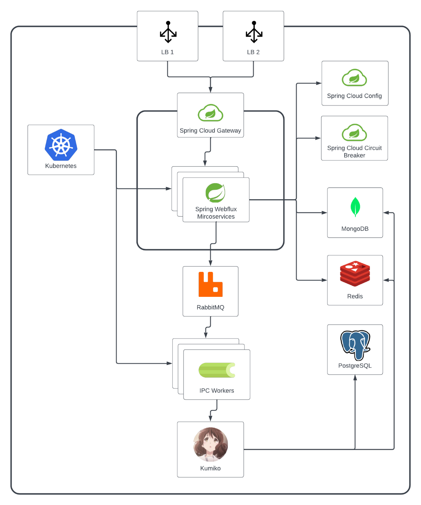
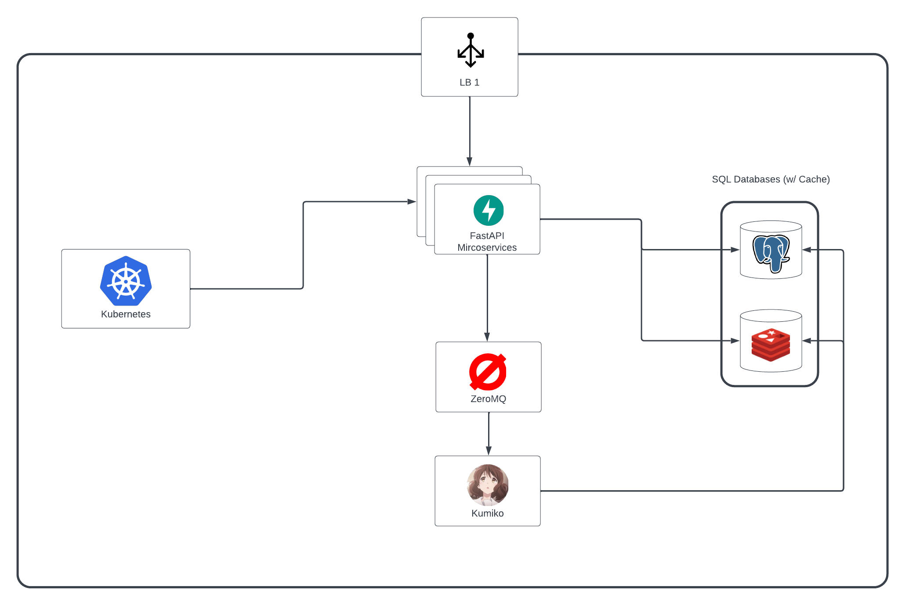

Since Kumiko was created, there have been a lot of changes in the infrastructure. This is a history of the infrastructure.

Kumiko originally was deployed with PostgreSQL, MongoDB, and RabbitMQ. The original purpose was to have all user inventory, and other data be stored on PostgreSQL, and the "marketplace" system be stored on MongoDB due to how flexible MongoDB is. As an naive developer who was also working on her first Discord Bot, Rin, thought that this was a good idea. But it turns out, it's a horrible idea. 

Over time, MongoDB was dropped in favor of PostgreSQL (and later RabbitMQ). Now it was just down to PostgreSQL. With the introduction of Kumiko's web backend as a feature that would be added, the infrastructure got more and more complex. I thought back then by tacking on more tools, I was becoming the next cool dev in town, willing to show off all of the tools used to run a simple bot. But in reality, I was just making it harder for myself to maintain the infrastructure.

Now one of the most important parts between the bot and the microservices - the IPC workers. These workers were originally made with Celery in order to load balance and distribute the amount of work that was needed. But when tested, this caused more lag and more issues than it solved. These celery workers are part of the Kumiko-IPC repo. 

As you see, this is just way too complex. Over time, most of these were dropped. There was no need for RabbitMQ since I had discovered ZeroMQ, which seemed to be the perfect replacement for RabbitMQ, and the Celery workers were scrapped at that time. Now it just left me with Kubernetes, and some others to replace.

And it leaves us with today. The picture shown above is the planned infrastructure that Kumiko will be using. It's a lot simpler, and easier to maintain. The only thing that is left is to implement it.